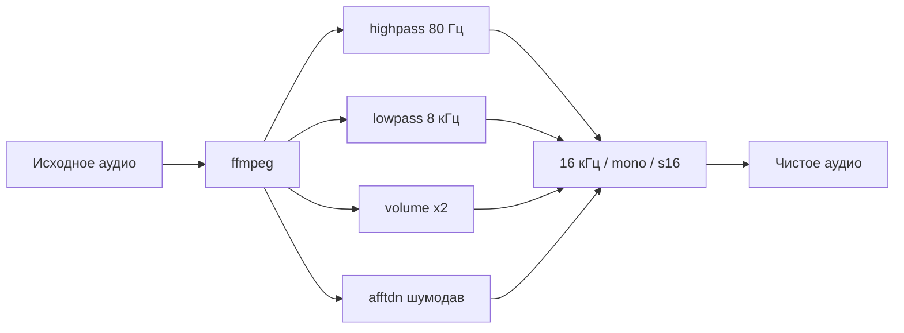

# Topex AI Analyst — Changelog

> Бот аудита звонков: amoCRM → Whisper → LLM → Telegram
> Разработчик: **Otabek** (kreziy7)
> Репозиторий: `yahykomilov/topex-ai-analyst` (private)

---

## Оглавление

1. [Структура проекта](#структура-проекта)
2. [Issue #5 — Статусы звонков](#issue-5--статусы-звонков)
3. [Issue #3 — Промпт чек-листа](#issue-3--промпт-чек-листа)
4. [Issue #4 — Качество распознавания узбекского](#issue-4--качество-распознавания-узбекского)
5. [Конфигурация (.env)](#конфигурация-env)
6. [Git — ветки и CI](#git--ветки-и-ci)

---

## Структура проекта

```
topex-ai-analyst/
├── main.py                  # Точка входа: Telegram бот + amoCRM пуллинг
├── config.py                # Все переменные окружения
├── transcriber.py           # Мульти-провайдерная расшифровка аудио
├── preprocess.py           # [NEW] Предобработка аудио (шумодав, нормализация)
├── analyzer.py              # LLM-анализ транскрипта
├── prompt.py                # Чек-лист промптов (рус/узб)
├── db.py                    # SQLite: схема + запросы
├── amocrm.py                # Интеграция с amoCRM API
├── Markdown/
│   └── CHANGELOG.md         # [NEW] Этот файл
├── data/                    # База + аудио
├── .env.example             # Шаблон конфига
└── requirements.txt
```

---

## Issue #5 — Статусы звонков

**Статус: ✅ Реализовано**

### Что сделано

Добавлена колонка `call_status` в таблицу `calls`. Статусы из amoCRM:

| Код | Статус | Иконка |
|-----|--------|--------|
| 1 | Планируется | 📞 |
| 2 | Запланирован | 📅 |
| 3 | Совершён | 🔄 |
| 4 | Разговор | ✅ |
| 5 | Пропущен | 📳 |
| 6 | Недозвон | ❌ |
| 7 | Нет соединения | 🚫 |

### Изменённые файлы

- `db.py` — миграция + колонка, константы `CALL_STATUS_LABELS`, `CALL_STATUS_SHORT`
- `main.py` — отображение статусов во всех списках звонков; недозвон/пропуск сохраняется без анализа
- `amocrm.py` — передача `call_status` из webhook/API

### Логика обработки

```
Звонок из amoCRM
  ├─ call_status = 4 (разговор) → расшифровка → LLM-анализ
  ├─ call_status = 5,6,7 (недозвон/пропуск/нет соединения) → сохранение без анализа
  └─ call_status = NULL → анализ (обратная совместимость)
```

### Багфикс

В Python 3.12.3 `sqlite3.Row` **не имеет метода `.get()`**. Исправлено: `c.get("call_status")` → `c["call_status"]`.

---

## Issue #3 — Промпт чек-листа

**Статус: ✅ Реализовано**

### Что сделано

Полностью переписан промпт-чек-лист под реальные звонки:

- **5 критериев оценки** (0-2 балла каждый):
  1. Приветствие и представление
  2. Выявление потребности
  3. Презентация решения
  4. Работа с возражениями
  5. Завершение диалога
- Поддержка **русского и узбекского** языков
- **Структурированный вывод** в JSON-подобном формате
- Парсинг результата в `analyzer.py`

### Изменённые файлы

- `prompt.py` — полный перезапуск промптов
- `analyzer.py` — парсинг структурированного вывода, скоринг

---

## Issue #4 — Качество распознавания узбекского

**Статус: 🟡 Реализовано (нужен API-ключ Gemini)**

### Что сделано

#### 1. `preprocess.py` — аудиопредобработка



#### 2. `transcriber.py` — мульти-провайдер

Каскадная схема с автоматическим fallback:

```
Groq Whisper #1 ──→ качество плохое? ──→ Groq Whisper #2 ──→ Gemini 2.0 Flash ──→ OpenAI Whisper
      ✓ берём                              ✓ берём               ✓ берём               ✓ берём
```

**Quality Check** (`_quality_check`):
- Длина транскрипта < 30 символов → плохо
- Буквы < 50% от строки → мусор → плохо
- Поддерживает кириллицу + латиницу (узбекский)

#### 3. `config.py` — новые ключи

- `GEMINI_API_KEY` — Google Gemini
- `GEMINI_MODEL` — модель (по умолчанию `gemini-2.0-flash`)
- `GROQ_API_KEY_2` — запасной Groq аккаунт

### Изменённые файлы

- `preprocess.py` — [NEW]
- `transcriber.py` — полный рефакторинг
- `config.py` — +3 новых ключа
- `main.py` — preprocess перед transcribe в обоих ветках

---

## Конфигурация (.env)

> ⚠️ Файл `.env` **не коммитится** в git. Все актуальные значения хранятся в Render Dashboard.
> Ниже — шаблон для локальной разработки.

```env
# ==== Telegram ====
TELEGRAM_BOT_TOKEN=        # Токен бота от @BotFather

# ==== Модель анализа ====
OPENAI_API_KEY=            # OpenAI (платно, fallback)
ANALYSIS_MODEL=gpt-4o-mini
ANTHROPIC_API_KEY=         # Claude (опционально)
CLAUDE_MODEL=claude-sonnet-5

# ==== Groq (бесплатно: расшифровка + анализ) ====
GROQ_API_KEY=              # Основной аккаунт
GROQ_API_KEY_2=            # Запасной (rate-limit fallback)
GROQ_WHISPER_MODEL=whisper-large-v3-turbo
GROQ_ANALYSIS_MODEL=llama-3.3-70b-versatile

# ==== Gemini (запасной транскрибер для узбекского) ====
GEMINI_API_KEY=            # Google AI Studio
GEMINI_MODEL=gemini-2.0-flash

# ==== amoCRM ====
AMO_SUBDOMAIN=             # XXX.amocrm.ru
AMO_ACCESS_TOKEN=          # Долгосрочный токен

# ==== Настройки ====
WHISPER_LANGUAGE=          # uz / ru / en (пусто = авто)
MANAGER_WHITELIST=         # Операторы через запятую
MIN_CALL_DURATION=20       # Пропускать звонки короче N сек
POLL_INTERVAL=120          # Интервал опроса amoCRM, сек
```

---

## Git — ветки и CI

### Правила работы

- **`main`** — только через PR, смерживает **`yahykomilov`** (тимлид)
- **`xcrpty7`** — рабочая ветка Otabek, форкается от `main`
- Все коммиты сначала в `xcrpty7`, затем PR в `main`

### Как запустить

```bash
git clone https://github.com/yahykomilov/topex-ai-analyst.git
cd topex-ai-analyst
cp .env.example .env
# Заполнить .env
pip install -r requirements.txt
python3 main.py
```

### Зависимости

```text
aiogram>=3.15
openai>=1.55
httpx>=0.27
python-dotenv>=1.0
truststore>=0.10
certifi
google-genai>=2.6.0
google-generativeai>=0.8.6
ffmpeg (system)
```

---

## Планы

- [ ] Интеграция Claude для анализа (когда появится ключ)
- [ ] Веб-дашборд статистики
- [ ] Автоматические отчёты в Telegram по расписанию
- [ ] Сравнение провайдеров расшифровки (WER на узбекском)

---

*Last updated: 2026-07-31 | Otabek @kreziy7*
